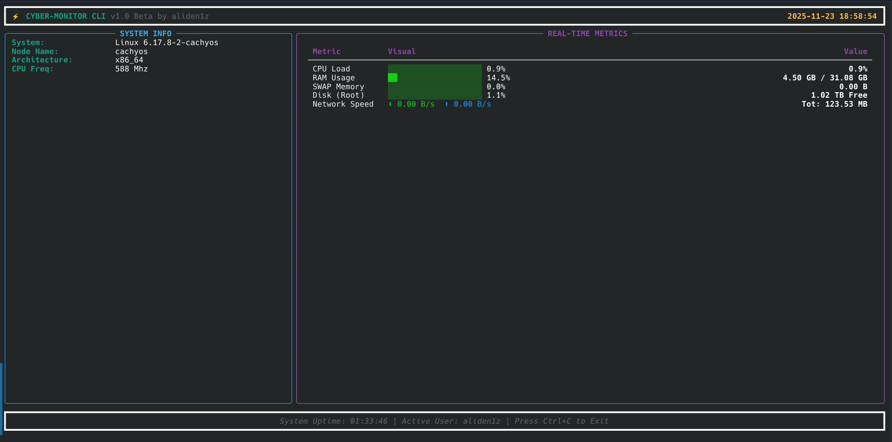

# ⚡ Cyber Monitor CLI

This is a terminal-based system monitor dashboard I built using Python. 

I wanted something that looks cooler than the standard `top` command and gives me a "cyberpunk" vibe while monitoring my Linux system. It runs completely in the terminal but features a responsive, panel-based UI.

## 📸 Dashboard Preview



## 🚀 Features

- **Real-Time Monitoring:** Updates CPU, RAM, Swap, and Disk usage every second.
- **Network Speedometer:** Shows live Download and Upload speeds (KB/s or MB/s).
- **System Info Panel:** Displays your OS, Kernel version, Hostname, and CPU frequency.
- **Visual Indicators:** Progress bars change color based on load (Green → Yellow → Red).
- **Full Screen:** Runs in a dedicated screen buffer (doesn't clutter your terminal history).

## 🛠️ Built With

- **Python 3**
- **Rich** (For the TUI and layout)
- **Psutil** (For fetching system metrics)

## 📥 Installation

1. Clone this repository:
   ```bash
   git clone https://github.com/aliden1z/cyber-monitor-cli.git
   cd cyber-monitor-cli
   ```

2. Create a virtual environment (Recommended):
   ```bash
   # Linux / Mac
   python3 -m venv venv
   source venv/bin/activate
   
   # Windows
   python -m venv venv
   venv\Scripts\activate
   ```

3. Install the required packages:
   ```bash
   pip install -r requirements.txt
   ```

## 💻 Usage

Just run the script:

```bash
python monitor.py
```

*Press `Ctrl + C` to exit the dashboard safely.*

## 🐧 License

MIT License. Feel free to modify and use it!
